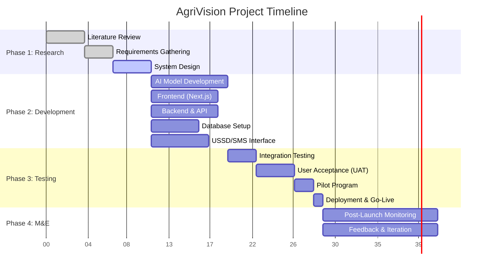

# AgriVision Proposal

## Chapter 1: Introduction

### 1.1 Introduction

"Your Shamba, Smarter."

**Mission:** Empower Kenyan smallholder farmers with AI-driven, accessible tools to boost productivity, resilience, and market access, transforming their farms into thriving, sustainable businesses.

**Vision:** To be the go-to digital partner for every mkulima (farmer), bridging the gap between traditional farming and modern technology, while driving food security and economic growth in line with Kenya’s Vision 2030 and SDG 2 (Zero Hunger).

### 1.2 Background of the Study

Over 70% of Kenyans rely on agriculture, with smallholder farmers producing the bulk of the nation’s food. Agriculture is the backbone of Kenya’s economy, contributing approximately 26% of the Gross Domestic Product (GDP) directly and another 27% indirectly through linkages with other sectors [1]. This vital sector employs over 40% of the total population and more than 70% of Kenya’s rural people. The economic history of many advanced countries shows that agricultural prosperity significantly contributes to economic advancement. For Kenya, a developing nation, the dominance of agriculture largely contributes to the national income. [1] THE ROLE AGRICULTURE PLAYS TOWARDS THE ECONOMIC DEVELOPMENT OF A COUNTRY. KAAA. https://kaaa.co.ke/the-role-agriculture-plays-towards-the-economic-development-of-a-country/ Kenya’s agricultural sector is a cornerstone of its economy, contributing significantly to the nation’s Gross Domestic Product (GDP) and providing livelihoods for a vast majority of its population. This sector is not merely an economic driver but also a critical component of food security and rural development. The reliance on agriculture is particularly pronounced among smallholder farmers, who constitute the backbone of food production in the country. Their collective output is essential for feeding the nation and sustaining rural economies. The historical trajectory of economically advanced nations often reveals a strong correlation between agricultural prosperity and overall economic growth, a pattern that Kenya seeks to emulate as it continues its development journey [1].

Despite its pivotal role, the agricultural sector in Kenya, particularly among smallholder farmers, faces a myriad of challenges that impede its full potential. These challenges range from environmental factors such as climate change and water scarcity to socio-economic issues like limited access to credit, markets, and modern farming technologies. The traditional farming methods, while deeply rooted in cultural practices, often fall short in addressing contemporary agricultural demands, leading to suboptimal yields and increased vulnerability to external shocks. The need for innovative solutions that can bridge this gap between traditional practices and modern agricultural advancements is therefore paramount for Kenya’s sustainable development. [2] Smallholder Farmers in Kenya and Their Challenges. The Borgen Project. https://borgenproject.org/smallholder-farmers-in-kenya/

### 1.3 Problem Statement

Despite agriculture being the backbone of the Kenyan economy, smallholder farmers face numerous challenges that hinder their productivity and economic growth. These challenges contribute to persistent food insecurity and limit the potential of the agricultural sector. Prolonged drought, rising global temperatures, and economic instability have exacerbated food insecurity across Kenya, affecting both urban and rural populations as rising food prices make affordability difficult for families in extreme poverty. [2] Smallholder Farmers in Kenya and Their Challenges. The Borgen Project. https://borgenproject.org/smallholder-farmers-in-kenya/

Key challenges faced by Kenyan smallholder farmers include:

*   **Lack of Access to Services and Resources:** Small farms are often located in rural areas, isolated from wholesale markets. This forces farmers to sell their goods through brokers, making them vulnerable to fluctuating prices. Additionally, access to fertile land is limited due to land grabbing by larger companies. This scarcity of accessible and fertile land, coupled with the informal nature of land tenure in many rural areas, further complicates investment in long-term agricultural improvements and sustainable practices. [2] Smallholder Farmers in Kenya and Their Challenges. https://borgenproject.org/smallholder-farmers-in-kenya/
*   **Market Access Issues:** Smallholder farmers struggle to compete with multinational corporations that sell products at lower prices. Repressive policies and land grabbing practices have made small farmers dependent on larger companies for essential agricultural inputs. Furthermore, the lack of organized market structures, poor road networks, and limited access to transportation mean that farmers often incur high post-harvest losses and are unable to reach lucrative markets, leading to exploitation by middlemen and reduced profitability. [2] Smallholder Farmers in Kenya and Their Challenges. https://borgenproject.org/smallholder-farmers-in-kenya/
*   **Limited Access to Credit:** Obtaining credit remains a significant hurdle for smallholder farmers due to traditional lending practices that demand high collateral, impose high interest rates, and a general shortage of credit lending educational services. Financial institutions often perceive smallholder agriculture as a high-risk venture due to its susceptibility to weather fluctuations, market volatility, and lack of formal collateral. This limits farmers’ ability to invest in improved seeds, fertilizers, irrigation systems, or modern machinery, perpetuating a cycle of low productivity and poverty. [2] Smallholder Farmers in Kenya and Their Challenges. https://borgenproject.org/smallholder-farmers-in-kenya/
*   **Infrastructure Limitations:** While mobile communication devices are becoming essential tools for accessing and exchanging agricultural information, rural farmers face limitations due to unreliable power, internet connectivity issues, and high data package prices. The digital divide is a significant barrier, preventing many farmers from accessing vital information on weather forecasts, market prices, and best farming practices. This lack of reliable infrastructure also affects irrigation systems, storage facilities, and processing capabilities, all of which are crucial for enhancing agricultural productivity and reducing post-harvest losses. [2] Smallholder Farmers in Kenya and Their Challenges. https://borgenproject.org/smallholder-farmers-in-kenya/
*   **Water Scarcity:** Growing urbanization, increased water consumption, and various water uses have led to dwindling water distribution, severely affecting farms in rural areas, especially those dependent on artificial water applications. Climate change exacerbates this issue, leading to more frequent and intense droughts. Farmers often lack access to modern irrigation techniques or water harvesting technologies, making their livelihoods highly vulnerable to erratic rainfall patterns and prolonged dry spells. This directly impacts crop yields and food security. [2] Smallholder Farmers in Kenya and Their Challenges. https://borgenproject.org/smallholder-farmers-in-kenya/
*   **Government Policies and Laws:** Existing government-enacted laws often favor large agricultural corporations, making it difficult for small farmers to afford certifications and obtain seeds. The criminalization of traditional seed sharing further impacts their livelihoods, as this was a cost-effective method of obtaining seeds for generations. Policies related to subsidies, land use, and trade can also disproportionately affect smallholder farmers, limiting their competitiveness and ability to adapt to changing market conditions. There is a critical need for policies that support and protect smallholder interests, promoting equitable access to resources and opportunities. [2] Smallholder Farmers in Kenya and Their Challenges. https://borgenproject.org/smallholder_farmers-in-kenya/

These multifaceted challenges underscore the need for innovative solutions like AgriVision to empower smallholder farmers and unlock Kenya’s full agricultural potential.

### 1.4 Problem Solution

AgriVision addresses these multifaceted challenges by providing a comprehensive, AI-driven digital assistant designed to empower Kenyan smallholder farmers. Our solution leverages cutting-edge artificial intelligence, including advanced machine learning algorithms and computer vision techniques, to deliver actionable insights and support. This bridges the critical gap between traditional farming practices and modern technological advancements, offering a pathway to increased productivity and resilience. By offering real-time, personalized recommendations based on various data inputs, including high-resolution images and video feeds of crops, soil, and livestock, and facilitating direct market access, AgriVision aims to significantly boost agricultural productivity, enhance resilience against the adverse effects of climate change, and ultimately improve the economic well-being and food security of smallholder farmers across Kenya. Our approach is meticulously aligned with Kenya’s Vision 2030, the nation’s long-term development blueprint, which explicitly emphasizes transforming the agricultural sector into an innovative, commercially-oriented, and modern industry. [3] Kenya Vision 2030: Agriculture Sector. https://vision2030.go.ke/sectors/agriculture/ AgriVision contributes directly to this ambitious vision by promoting sustainable agricultural practices, fostering technological adoption, and stimulating economic growth within the farming community. The platform is designed with inclusivity at its core, ensuring accessibility even to farmers with basic mobile phones through user-friendly USSD and SMS interfaces. This commitment to accessibility is crucial for ensuring widespread adoption and impact across rural areas, where smartphone penetration and internet connectivity may still be limited. Furthermore, AgriVision aims to provide localized solutions, taking into account the diverse agro-ecological zones and cultural contexts within Kenya, thereby ensuring relevance and effectiveness for a broad spectrum of farmers.

### 1.5 Objectives of the System

#### 1.5.1 Main Objective

To empower Kenyan smallholder farmers with AI-driven, accessible tools to boost productivity, resilience, and market access, transforming their farms into thriving, sustainable businesses. This overarching objective guides all development and deployment efforts, focusing on tangible improvements in farmers’ livelihoods and the overall agricultural landscape.

#### 1.5.2 Specific Objectives

*   To provide real-time, AI-powered diagnosis and treatment recommendations for crop diseases and pest infestations, utilizing both image and video analysis to minimize crop loss and optimizing yields. This objective leverages advanced computer vision to identify issues quickly and accurately, offering timely interventions that can save entire harvests. The system will be trained on a vast dataset of crop images and videos, enabling it to recognize a wide range of diseases and pests prevalent in Kenya.
*   To deliver personalized farming schedules, optimal harvesting times, and tailored advice on crop rotation and soil management, enhancing efficiency and resource utilization. By analyzing local weather patterns, soil data, and crop cycles, AgriVision will provide farmers with precise guidance, reducing guesswork and promoting sustainable practices. This includes recommendations on the best planting times, irrigation schedules, and nutrient management strategies.
*   To facilitate direct connections between farmers and buyers, eliminating intermediaries and ensuring fair prices for produce, thereby improving farmers’ income and market access. This objective aims to create a more equitable value chain, allowing farmers to bypass exploitative middlemen and directly access markets where they can command better prices for their produce. The platform will include features for listing produce, negotiating prices, and arranging logistics.
*   To ensure accessibility of core AgriVision features to farmers with basic phones through USSD and SMS interfaces, overcoming barriers of digital literacy and smartphone ownership. Recognizing the digital divide in rural Kenya, this objective prioritizes inclusivity, making sure that even farmers without smartphones or internet access can benefit from AgriVision’s insights. This will involve developing simple, intuitive interfaces that can be navigated using basic feature phones.
*   To offer interactive voice support in local languages, enabling farmers to interact with the system naturally and receive information in their preferred dialect. This objective addresses language barriers and promotes ease of use, allowing farmers to communicate with AgriVision in their native tongues. The voice support system will be powered by natural language processing (NLP) to understand and respond to farmer queries effectively.
*   To lay the groundwork for future precision farming enhancements, including satellite imagery analysis and IoT sensor integration, to further optimize agricultural practices. This objective outlines AgriVision’s long-term vision, aiming to incorporate cutting-edge technologies for even more precise and data-driven farming. This will enable farmers to monitor their fields remotely, detect subtle changes in crop health, and optimize resource allocation with unprecedented accuracy.

### 1.6 Research Questions

Based on the objectives outlined, the following research questions will guide the development and implementation of AgriVision:

*   How effectively can AI-powered diagnosis and treatment recommendations for crop diseases and pest infestations minimize crop loss and optimize yields for smallholder farmers in Kenya?
*   To what extent can personalized farming schedules, optimal harvesting times, and tailored advice on crop rotation and soil management enhance efficiency and resource utilization for smallholder farmers?
*   How can direct connections between farmers and buyers, facilitated by AgriVision, eliminate intermediaries and ensure fair prices for produce, thereby improving farmers’ income and market access?
*   What are the key challenges and solutions in ensuring accessibility of core AgriVision features to farmers with basic phones through USSD and SMS interfaces, overcoming barriers of digital literacy and smartphone ownership?
*   How can interactive voice support in local languages enable farmers to interact with the system naturally and receive information in their preferred dialect, thereby improving user engagement and adoption?
*   What groundwork is necessary for future precision farming enhancements, including satellite imagery analysis and IoT sensor integration, to further optimize agricultural practices for smallholder farmers?

### 1.7 Scope of the Study

This study focuses on the development and implementation of AgriVision, an AI-driven digital assistant tailored for Kenyan smallholder farmers. The scope encompasses the design, development, and deployment of core features aimed at addressing critical challenges faced by these farmers, including crop disease and pest management, personalized farming advice, and market access facilitation. The system will prioritize accessibility, offering interfaces compatible with both smartphones and basic mobile phones (via USSD and SMS). Geographically, the initial deployment and pilot programs will target key agricultural regions within Kenya, with a view to scalable expansion across the country. The study will also cover the technological infrastructure required for AI model training and deployment, data management strategies, and user interface design for optimal farmer engagement. The project aims to deliver a robust, scalable, and user-centric solution that directly contributes to the economic empowerment of smallholder farmers and enhances food security in Kenya.

### 1.8 Project Description

AgriVision is an innovative AI-powered digital assistant designed to revolutionize smallholder farming in Kenya. The platform will provide farmers with real-time, actionable insights and support across various aspects of their agricultural practices. Key features include:

*   **AI-Powered Crop Disease and Pest Diagnosis:** Utilizing advanced computer vision, farmers can upload images or short videos of their crops to receive instant diagnosis of diseases and pest infestations, along with recommended treatment plans. This feature aims to significantly reduce crop loss due to preventable issues.
*   **Personalized Farming Advice:** Based on local weather data, soil conditions, crop type, and growth stage, AgriVision will provide tailored advice on optimal planting times, irrigation schedules, fertilization, and crop rotation. This ensures efficient resource utilization and maximizes yields.
*   **Market Access Facilitation:** The platform will connect farmers directly with buyers, eliminating middlemen and ensuring fair prices for their produce. Features will include a marketplace for listing produce, price negotiation tools, and logistics support.
*   **Accessible Interfaces:** Recognizing the diverse technological landscape in rural Kenya, AgriVision will be accessible via multiple channels:
    *   **USSD & SMS:** For farmers with basic feature phones, providing access to critical information and services without internet connectivity.
    *   **Mobile Application:** A user-friendly smartphone application for farmers with internet access, offering rich visual content and advanced features.
    *   **Web Portal:** A comprehensive web-based platform for agricultural extension officers and larger farm cooperatives to manage and monitor multiple farms.
*   **Multilingual Voice Support:** To overcome language barriers, AgriVision will offer interactive voice support in various local Kenyan languages, allowing farmers to interact with the system naturally.

**Technology Stack:** The AgriVision platform will be built using a modern and scalable technology stack to ensure robust performance, maintainability, and future expandability. The frontend will be developed using **Next.js**, a React framework that enables server-side rendering and static site generation, providing excellent performance and SEO capabilities. The backend will leverage **Python** with **Django/Flask** for building robust APIs and handling business logic. **TensorFlow/PyTorch** will be used for developing and deploying AI/ML models, particularly for computer vision tasks. Data storage will utilize a combination of **PostgreSQL** for structured data and **MongoDB** for unstructured data (e.g., images, videos). Cloud infrastructure will be provisioned on **Google Cloud Platform (GCP)**, utilizing services like AI Platform, Cloud Storage, and Kubernetes Engine for scalable deployment and management.

### 1.9 System Requirements

#### 1.9.1 Hardware Requirements

*   **Servers:** Cloud-based virtual machines (e.g., GCP Compute Engine) with scalable CPU, RAM, and GPU resources for AI model training and inference.
*   **Storage:** Cloud Storage (e.g., GCP Cloud Storage) for storing large datasets of images, videos, and other agricultural data.
*   **Networking Equipment:** Standard internet infrastructure for connectivity (routers, switches, firewalls).
*   **User Devices:** Smartphones (Android/iOS) for the mobile application, and basic feature phones for USSD/SMS access.

#### 1.9.2 Software Requirements

*   **Operating System:** Linux (e.g., Ubuntu) for server environments.
*   **Frontend Framework:** Next.js
*   **Backend Framework:** Python (Django/Flask)
*   **Database:** PostgreSQL, MongoDB
*   **AI/ML Frameworks:** TensorFlow/PyTorch
*   **Cloud Platform:** Google Cloud Platform (GCP)
*   **Version Control:** Git
*   **Containerization:** Docker, Kubernetes
*   **APIs:** Integration with third-party APIs for weather data, satellite imagery (if applicable), and payment gateways.

### 1.10 Risk and Mitigation

| Risk Category | Specific Risk | Mitigation Strategy |
| :------------ | :------------ | :------------------ |
| **Technical Risks** | AI model inaccuracy in diagnosis. | Continuously collect and annotate diverse datasets, implement robust validation protocols, and integrate feedback loops from farmers for model refinement. |
| | Scalability issues with growing user base. | Design a microservices architecture, leverage cloud-native services (Kubernetes Engine), and implement load balancing and auto-scaling. |
| | Data security and privacy breaches. | Implement end-to-end encryption, adhere to strict data protection regulations (e.g., GDPR, local Kenyan laws), and conduct regular security audits. |
| | Integration challenges with diverse mobile devices. | Develop and rigorously test USSD/SMS interfaces for compatibility across various feature phones; ensure mobile app responsiveness and compatibility with different OS versions. |
| **Operational Risks** | Low adoption rate among farmers. | Conduct extensive user training, provide localized support, ensure user-friendly interfaces, and demonstrate clear value proposition through pilot programs. |
| | Lack of reliable internet connectivity in rural areas. | Prioritize offline functionalities (USSD/SMS), optimize data usage for the mobile app, and explore partnerships with local telecom providers. |
| | Insufficient data for AI model training. | Collaborate with agricultural research institutions, government agencies, and local farming cooperatives for data collection and annotation. |
| **Financial Risks** | Insufficient funding for development and scaling. | Diversify funding sources (grants, impact investors, premium subscriptions) and implement lean operational practices. |
| | Unforeseen development costs. | Implement agile development methodologies, conduct thorough cost estimations, and maintain a contingency budget. |
| **External Risks** | Regulatory and policy changes. | Engage with government bodies and agricultural ministries to advocate for supportive policies and ensure compliance. |
| | Competition from existing agricultural solutions. | Differentiate AgriVision through superior AI capabilities, accessibility, and localized support, focusing on underserved segments. |
| | Environmental factors (e.g., severe droughts, floods). | Integrate climate-resilient farming practices into recommendations and develop early warning systems. |

### 1.11 Budget

This budget outlines the estimated costs for the development and initial deployment of the AgriVision platform, converted to Kenyan Shillings (KES) at an approximate exchange rate of 1 USD = 130 KES. These figures are estimates and may vary based on market conditions and specific vendor pricing.

| Category | Item | Estimated Cost (KES) | Justification |
| :------- | :--- | :------------------- | :------------ |
| **Development & Technology** | Cloud Server Costs | 650,000 | Annual cost for virtual machines, storage, and AI platform services on GCP. Essential for hosting the application, databases, and running AI models. |
| | Domain & Hosting | 13,000 | Annual cost for website domain registration and basic web hosting for the main portal. |
| | SMS/USSD Gateway Fees | 260,000 | Estimated annual cost for sending SMS messages and managing USSD sessions, crucial for reaching farmers with basic phones. |
| | AI Model Training Data Acquisition & Annotation | 390,000 | Costs associated with collecting, cleaning, and annotating large datasets of crop images, disease samples, and agricultural data for AI model training. |
| | Software Licenses (if any) | 130,000 | Potential costs for specialized software, APIs, or development tools not covered by open-source alternatives. |
| **Personnel** | Developer (Contract/Freelance) | 1,300,000 | Estimated cost for a skilled developer to build and maintain the platform for the project duration (e.g., 6-12 months). |
| | Agricultural Expert/Consultant | 390,000 | Fees for consulting with agricultural experts to ensure accuracy of farming advice and disease diagnoses. |
| **Marketing & Outreach** | Farmer Training & Workshops | 260,000 | Costs for organizing and conducting training sessions for farmers on how to use the AgriVision platform effectively. |
| | Localized Marketing Materials | 65,000 | Development and printing of brochures, posters, and other marketing materials in local languages. |
| **Miscellaneous** | Contingency (10% of total) | 356,800 | To cover unforeseen expenses and provide flexibility during the project lifecycle. |
| **Total Estimated Project Cost** | | **3,914,800 KES** | |

### 1.12 Project Timeline (Gantt Chart)

This Gantt chart outlines the proposed timeline and key milestones for the AgriVision project.

### 1.13 Conclusion

AgriVision represents a timely and essential intervention for the Kenyan agricultural sector. By harnessing the power of AI and accessible digital technologies, it aims to address critical challenges faced by smallholder farmers, fostering increased productivity, economic empowerment, and food security. The comprehensive approach, focusing on personalized advice, direct market access, and inclusive accessibility, positions AgriVision as a transformative solution aligned with national development goals. With a robust technical foundation and a clear roadmap for implementation, AgriVision is poised to make a significant and sustainable impact on the lives of Kenyan farmers, contributing to a more prosperous and food-secure future.

## Chapter 2: Literature Review

### 2.0 Introduction

This chapter presents a comprehensive review of existing literature pertinent to the AgriVision project, focusing on the intersection of agriculture, artificial intelligence, and socio-economic development in the context of smallholder farming in Kenya. The review aims to establish a foundational understanding of the current state of research, identify key theoretical frameworks, and highlight empirical findings that inform the design and implementation of AgriVision. By critically analyzing previous studies, this chapter will identify gaps in existing knowledge and solutions, thereby justifying the unique contributions of the AgriVision system. The literature review is structured to cover three main areas: information on the topic, additions of knowledge (who said what), and criticisms and comparisons of existing solutions.

### 2.1 Past Information (What has been said before about my topic)

This section will delve into existing research and literature related to agricultural technology, smallholder farming challenges in Kenya, and the application of AI in agriculture. It will cover previous studies on crop disease detection, personalized farming advice systems, and market access solutions for farmers in developing countries. We will analyze the methodologies, findings, and limitations of these prior works to establish a comprehensive understanding of the current landscape.

### 2.2 Additions of Knowledge (Who said what)

This subsection will highlight the specific contributions of AgriVision to the existing body of knowledge. It will detail how our AI-driven approach, particularly the integration of image and video analysis for diagnosis, personalized farming schedules, and direct farmer-to-buyer connections, builds upon and extends previous research. We will cite relevant authors and their contributions, demonstrating how AgriVision addresses gaps or improves upon existing solutions in the context of Kenyan smallholder farming.

### 2.3 Criticism & Comparisons

Here, we will critically evaluate existing agricultural technology solutions and research, comparing their strengths and weaknesses with AgriVision. This will include an analysis of their accessibility, effectiveness, scalability, and sustainability in the Kenyan context. We will discuss the limitations of current approaches, such as reliance on expensive hardware, lack of localization, or insufficient data integration, and articulate how AgriVision overcomes these challenges. This comparative analysis will underscore the unique value proposition and innovative aspects of our proposed system.

