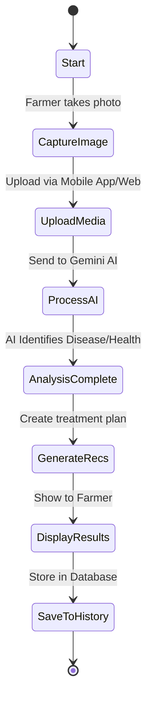
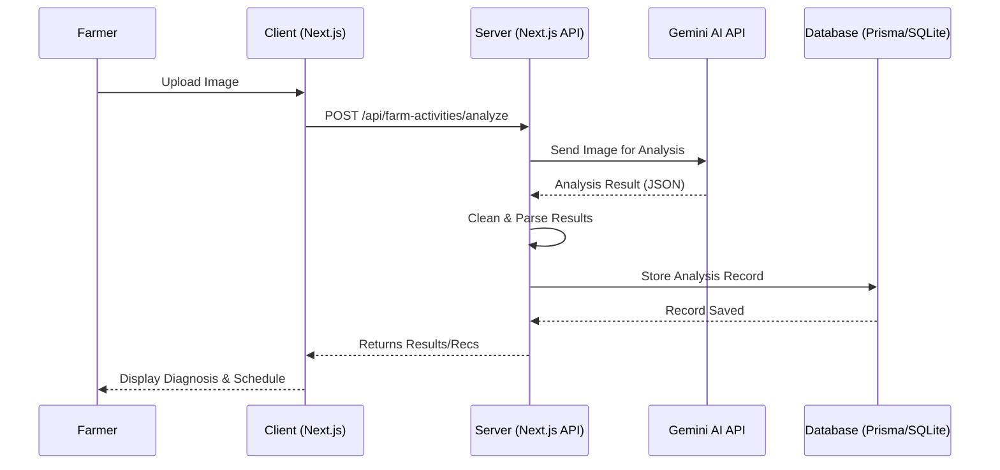
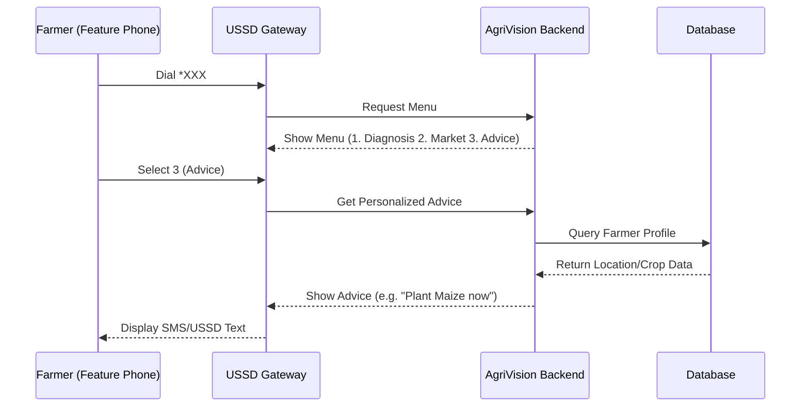
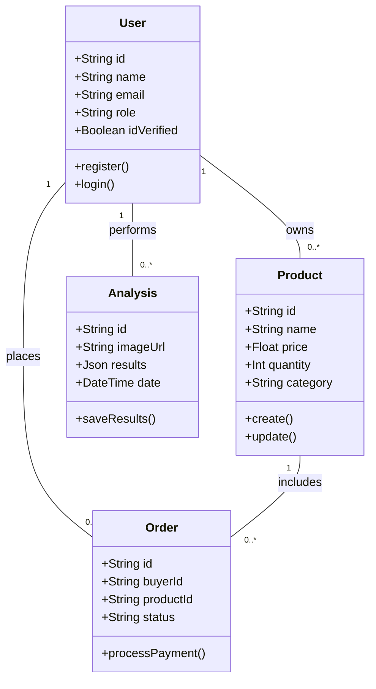
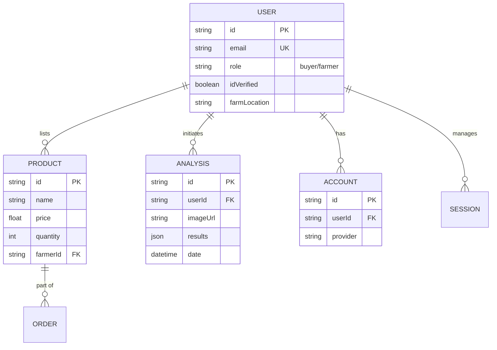
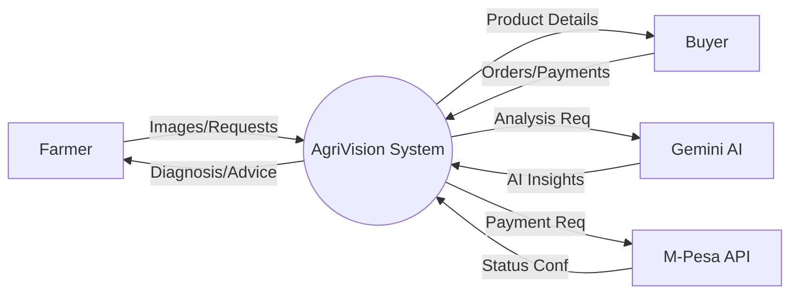

## CHAPTER 4: SYSTEM ANALYSIS AND DESIGN

### 4.1 System Analysis

#### 4.1.1 Analysis of the Current System
Currently, smallholder farmers in Kenya rely heavily on traditional knowledge and infrequent visits from agricultural extension officers. The ratio of extension officers to farmers is significantly high, leading to delays in identifying and treating crop diseases. This manual process is:
- **Reactive:** Issues are often detected after significant damage has occurred.
- **Inconsistent:** Diagnosis quality depends on the specific officer's expertise.
- **Slow:** Obtaining expert advice can take days or weeks, allowing diseases to spread.
- **Disconnected:** Farmers have limited direct access to fair markets, often relying on middlemen.

#### 4.1.2 Analysis of the Proposed System
AgriVision introduces a proactive, digital-first approach:
- **Instant Diagnosis:** AI-powered analysis of images and videos provides immediate feedback.
- **Data-Driven Advice:** Personalized farming schedules based on real-time weather and soil data.
- **Inclusive Access:** USSD/SMS support ensures that even farmers without smartphones are included.
- **Direct Market Access:** An integrated marketplace connects farmers directly with buyers.
- **Scalable:** The cloud-based architecture allows for rapid expansion across Kenya without a proportional increase in physical staff.

#### 4.1.3 Feasibility Study
- **Technical Feasibility:** Leveraging Google Gemini AI and Next.js ensures a robust, modern platform capable of handling complex visual analysis and high traffic.
- **Economic Feasibility:** By reducing crop loss and eliminating middlemen, the system provides a high return on investment for farmers. Cloud hosting costs are manageable compared to the potential economic gain.
- **Operational Feasibility:** The simple interfaces (mobile app and USSD) are designed specifically for the Kenyan context, ensuring ease of use for people with varying levels of technical literacy.

### 4.2 Use Case Diagram
#### Figure 4.1: AgriVision Use Case Diagram
```mermaid
usecaseDiagram
    actor Farmer
    actor Buyer
    actor "Agri-Expert" as Expert
    actor "Gemini AI" as AI

    package AgriVision {
        usecase "Upload Crop/Animal Media" as UC1
        usecase "Get AI Diagnosis" as UC2
        usecase "List Products for Sale" as UC3
        usecase "Browse/Buy Produce" as UC4
        usecase "Request Expert Consultation" as UC5
        usecase "View Farming Schedule" as UC6
        usecase "Verify Identity" as UC7
    }

    Farmer --> UC1
    Farmer --> UC3
    Farmer --> UC6
    Farmer --> UC7
    UC1 ..> UC2 : <<include>>
    AI --> UC2
    Buyer --> UC4
    Expert --> UC5
    UC5 ..> UC2 : <<extend>>
```

### 4.3 Activity Diagram (Image-Based Diagnosis)
#### Figure 4.2: Activity Diagram for the Image-Based Diagnosis Process


### 4.4 Sequence Diagrams

#### Figure 4.4: Sequence Diagram for AI Image Detection


#### Figure 4.5: Sequence Diagram for USSD Advisory Flow


### 4.5 Class Diagram
#### Figure 4.6: System Class Diagram


### 4.6 Entity Relationship Diagram (ERD)
#### Figure 4.7: Entity Relationship Diagram (ERD)


### 4.7 Data Flow Diagram (DFD)
#### Figure 4.8: Data Flow Diagram (Context Level)


### 4.8 System Architecture
AgriVision follows a modern 3-tier architecture:
1.  **Presentation Layer:** Next.js application providing a responsive web and mobile-friendly interface.
2.  **Application Layer:** Next.js API routes (Node.js) handling business logic, AI orchestration, and third-party integrations (Gemini, M-Pesa).
3.  **Data Layer:** SQLite database managed by Prisma ORM for persistent storage of user data, products, and analysis history.
