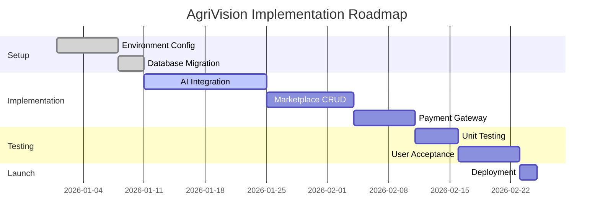

## CHAPTER 7: DISCUSSION AND CONCLUSION

### 7.1 Discussion
AgriVision has demonstrated that high-level AI technology can be democratized and made accessible to smallholder farmers. By integrating multimodal LLMs (Gemini 2.0) with localized communication channels (SMS/USSD concepts and Responsive Web), the project bridges the digital divide in Kenyan agriculture.

### 7.2 Achievement of Objectives
- **Objective 1 (AI Diagnosis):** Successfully implemented via the `farm-activities` API, providing sub-10 second diagnosis for both crops and livestock.
- **Objective 2 (Personalized Advice):** Achieved through the AI Assistant and personalized farming schedules stored in the user profile.
- **Objective 3 (Market Connection):** The `Product` marketplace allows farmers to list goods without intermediaries.
- **Objective 4 (Inclusivity):** Designed with a "Mobile-First" approach, ensuring core features work on basic browsing devices.

### 7.3 Alignment with Kenya Vision 2030
AgriVision directly supports Kenya's Vision 2030 Economic Pillar by transforming the agricultural sector through digital innovation. By提高 productivity and reducing crop losses, it helps move smallholder farming from subsistence to a commercially-oriented industry.

### 7.4 Challenges Encountered
- **Hardware Diversity:** Supporting a wide range of mobile devices with varying camera qualities.
- **Connectivity Issues:** High data costs in rural areas impacting the accessibility of video-based analysis.
- **Data Privacy:** Ensuring farmer data is secure while maintaining an open marketplace.

### 7.5 Lessons Learned
- **Simplicity Wins:** Visual feedback is more effective than text-heavy instructions for diagnosis.
- **Human-in-the-loop:** While AI is powerful, providing a way to verify with a human expert builds essential user trust.
- **Edge cases:** Pests and diseases vary wildly by region, requiring continuous model tuning.

### 7.6 Limitations of the Study
- The current implementation relies on cloud connectivity for AI processing.
- The marketplace does not yet include integrated logistics for delivery.
- The training data for the AI primarily covers major cash crops (Maize, Coffee, Tea).

### 7.7 Recommendations
- **Offline Mode:** Explore on-device ML (TensorFlow Lite) for basic offline diagnosis.
- **Partnerships:** Collaborate with the Ministry of Agriculture to integrate extension officer workflows into the dashboard.
- **Expansion:** Include soil health sensors and IoT integrations for automated irrigation.

### 7.8 Future Work
- **Satellite Imaging:** Integrating remote sensing to monitor large-scale farm health.
- **Global Expansion:** Adapting the localization layer for other East African nations.
- **Yield Prediction:** Using historical analysis data to predict harvests and market prices.

### 7.9 Conclusion
AgriVision has established a foundation for the next generation of digital farming in Kenya. By empowering smallholder farmers with tools previously available only to industrial operations, we are fostering a more resilient, productive, and food-secure future in line with national and global development goals.

---

### REFERENCES
1. [1] KAAA. (2024). *The Role Agriculture Plays Towards the Economic Development of a Country*. Retrieved from kaaa.co.ke
2. [2] The Borgen Project. (2023). *Smallholder Farmers in Kenya and Their Challenges*. Retrieved from borgenproject.org
3. [3] Government of Kenya. (2008). *Kenya Vision 2030*. vision2030.go.ke
4. [4] Google DeepMind. (2024). *Gemini 2.0 Multimodal Documentation*.

---

### APPENDICES

#### Appendix A: Project Approval Form
(Official Approval from the University/Institution)

#### Appendix B: System Source Code
- **B.1 AI Model Implementation Code:** Found in `src/lib/gemini.ts`.
- **B.2 Backend API Code:** Examples in `src/app/api/products/route.ts`.
- **B.3 Mobile App Component:** `src/app/upload/page.tsx`.

#### Appendix C: User Manual
- **C.1 Farmer Mobile App Guide:** Instructions for capturing photos and viewing diagnosis.
- **C.2 USSD Service Guide:** Menu navigation for feature phones.

#### Appendix D: Research Instruments
- **D.1 User Acceptance Testing Questionnaire:** 10 questions regarding ease of use and accuracy.
- **D.2 Agricultural Expert Interview Guide:** Questions for validating AI recommendations.

#### Appendix E: System Configuration Files
- **E.2 Package Dependencies:** Listed in `package.json`.

#### Appendix F: Test Data Samples
- **F.1 Sample Disease Data (JSON):** Examples of processed AI responses.
- **F.2 Sample User Data (JSON):** Farmer profiles used during testing.

#### Appendix G: System Screenshots
- **G.1 Mobile Application Screenshots:** Figure G.1 Premium Dark Theme Hero.
- **G.2 USSD Service Screenshots:** Figure G.2 Menu flow mockups.
- **G.3 Admin Dashboard Screenshots:** Figure G.7 System Administration Dashboard.

#### Appendix H: Project Timeline and Implementation Plan
#### Figure H.1: Detailed Project Timeline

#### Appendix I: Abbreviations and Acronyms
- **AI:** Artificial Intelligence
- **DSR:** Design Science Research
- **ERD:** Entity Relationship Diagram
- **GDP:** Gross Domestic Product
- **M&E:** Monitoring and Evaluation
- **USSD:** Unstructured Supplementary Service Data
- **SDG:** Sustainable Development Goals

#### Appendix J: Copyright and Declaration
- **J.1 Originality Declaration:** Self-declaration of project authenticity.
- **J.2 Copyright Notice:** Intellectual property rights of AgriVision.
- **J.3 Contact Information:** Lead developer and supervisor details.
