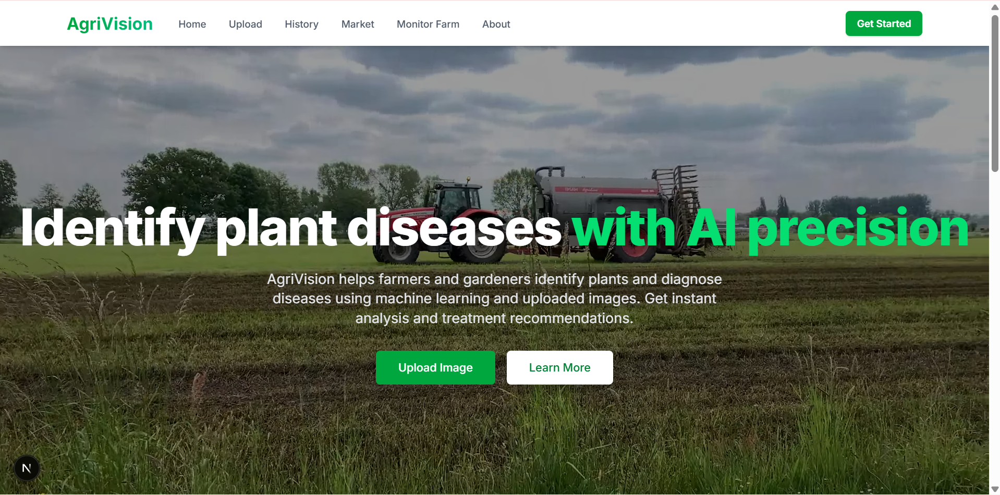
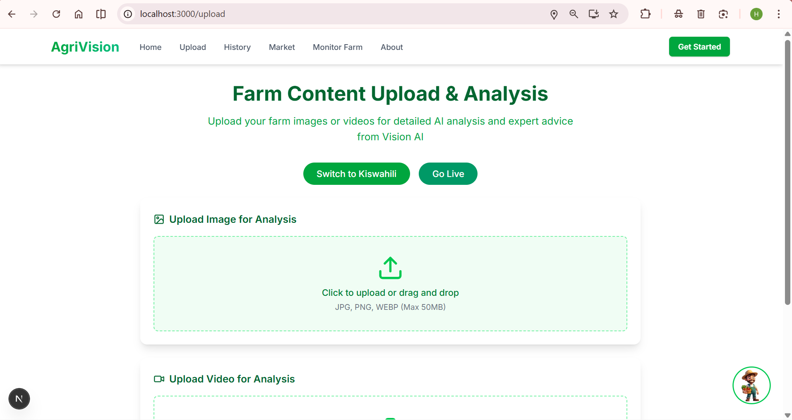
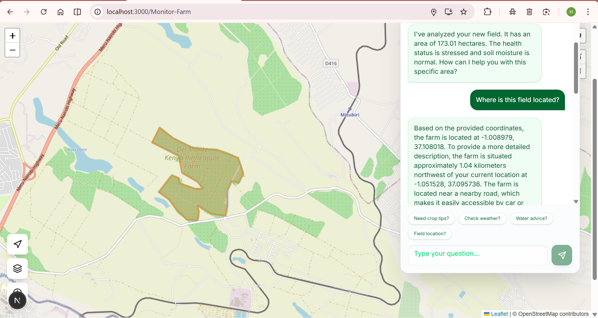
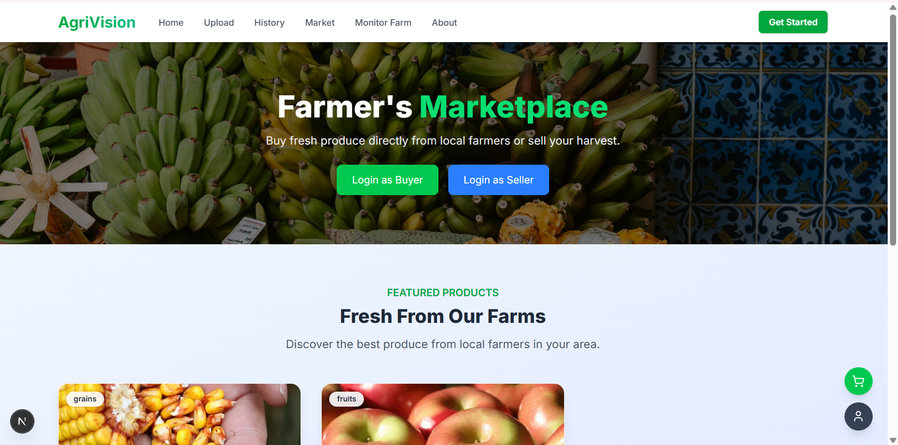
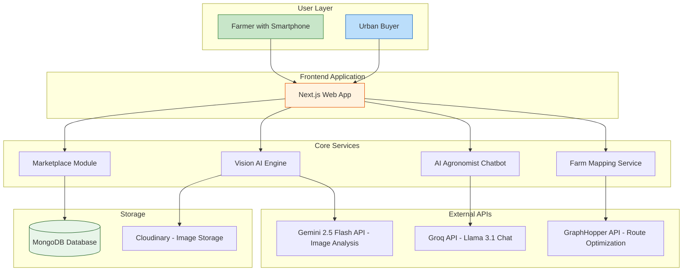
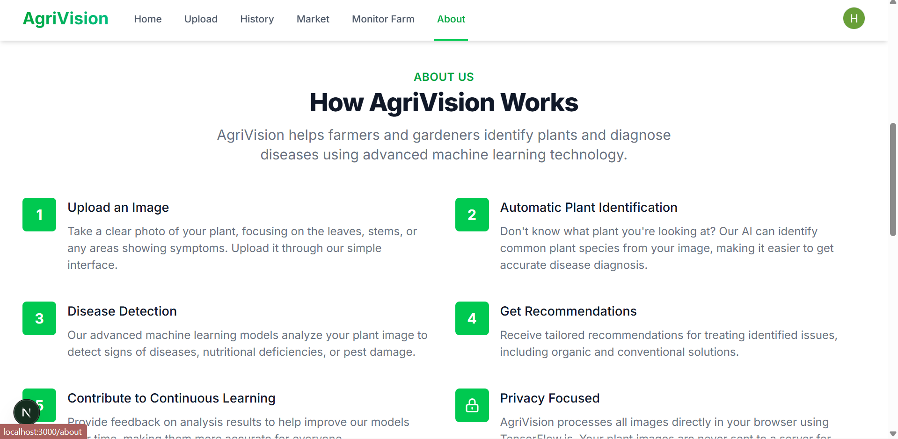

# AgriVision: Transforming Kenyan Agriculture Through Technology

AgriVision is a digital platform built to revolutionize how Kenyan farmers grow, protect, and sell their crops. We put the power of artificial intelligence directly into the hands of smallholder farmers, enabling them to make smarter decisions that lead to higher yields, reduced losses, and better incomes.



## The Problem We Are Solving

Agriculture is the backbone of Kenya's economy, contributing over 33% of the country's GDP and employing more than 70% of the rural population. Yet, Kenyan farmers face persistent challenges:

*   **Crop diseases go undetected** until it is too late, leading to significant harvest losses.
*   **Farmers lack access to expert advice**, especially in remote areas where agricultural extension officers are scarce.
*   **Middlemen exploit farmers**, taking large margins and leaving producers with little profit.
*   **Poor logistics and planning** result in wasted time, fuel, and resources.

These problems directly threaten food security, rural livelihoods, and Kenya's economic growth targets.

## Our Solution: Technology That Works for the Farmer

AgriVision addresses these challenges with a suite of tools designed with the Kenyan farmer in mind.

### 1. Instant Crop Disease Detection
Farmers can take a photo of a sick plant using their smartphone. Within seconds, AgriVision identifies the disease and provides clear, actionable treatment advice. This works even without internet, making it accessible in the most remote villages.

**Impact**: Early detection can save up to 40% of an affected harvest. Farmers no longer need to wait for an expert to arrive.



### 2. AI-Powered Farm Advisor
Farmers can chat with our virtual agronomist in English or Kiswahili. They can ask questions like:
*   "My maize leaves are turning yellow. What should I do?"
*   "When is the best time to apply fertilizer?"

The advisor provides answers based on the specific photo analysis and general best practices, giving every farmer access to expert guidance 24 hours a day, 7 days a week.

**Impact**: Democratizes agricultural knowledge. A farmer in Turkana receives the same quality advice as one in Nairobi.

### 3. Smart Farm Mapping and Route Planning
AgriVision helps farmers and agricultural officers visualize their land. They can see which areas of their farm are healthy, which are stressed, and plan the most efficient routes for inspection or spraying.

**Impact**: Reduces fuel costs, saves time, and ensures that every corner of the farm gets attention.



### 4. Direct-to-Consumer Marketplace
Farmers can list their produce directly on the AgriVision platform. Buyers in urban areas can browse and purchase fresh goods, cutting out the middlemen.

**Impact**: Farmers retain more of their profit. A tomato farmer in Kirinyaga can sell directly to a restaurant in Nairobi at a fair price.



## Alignment with Kenya Vision 2030

AgriVision is built to support the goals of Kenya Vision 2030, particularly under the Economic Pillar:

| Vision 2030 Goal | AgriVision Contribution |
|---|---|
| **Transform Agriculture** | We provide tools for precision farming. |
| **Increase Productivity** | Early disease detection prevents losses. |
| **Improve Farmer Incomes** | Our marketplace removes middlemen. |
| **Leverage Technology** | We use AI and mobile tech to reach rural areas. |
| **Ensure Food Security** | Healthier crops mean more food for Kenyans. |

By digitizing the agricultural value chain, AgriVision directly contributes to making Kenya a middle-income country with a high quality of life for all its citizens.

## How AgriVision Changes the Farmer's Perspective

Traditionally, a farmer's knowledge came from experience passed down through generations or sporadic visits from extension officers. AgriVision shifts this paradigm:

*   **From Reactive to Proactive**: Instead of treating a disease after it spreads, farmers can now catch it at the first sign.
*   **From Isolated to Connected**: Farmers join a digital ecosystem where they can access advice, markets, and community support.
*   **From Guesswork to Data-Driven**: Decisions about planting, treating, and selling are now informed by real-time data and AI analysis.

This is not just a tool; it is a new way of thinking about farming. It empowers the farmer to see themselves not just as a cultivator, but as a data-informed entrepreneur.

## System Architecture

The following diagram illustrates how the different parts of AgriVision work together:



**How It Works**:
1. The farmer opens the app on their phone and uploads an image or goes live with their camera.
2. The image is sent to **Google Gemini 2.5 Flash API** for analysis, which identifies diseases and crop conditions.
3. Results are passed to the **AI Agronomist Chatbot**, powered by **Groq API** with Llama 3.1, which answers follow-up questions.
4. If the farmer wants to check their fields, the **Farm Mapping Service** calls the **GraphHopper API** to calculate optimal inspection routes.
5. When ready to sell, the **Marketplace Module** stores listings in MongoDB and images in Cloudinary.



## Technology Stack (For Technical Teams)

For those interested in the underlying systems:

*   **Frontend**: Next.js 15, React 19, Tailwind CSS, Framer Motion
*   **AI/ML**: Google Gemini 2.5 Flash API for image analysis, Groq API with Llama 3.1 for chatbot
*   **Maps**: Leaflet.js, GraphHopper API for routing and isochrones
*   **Database**: MongoDB with Prisma ORM
*   **Storage**: Cloudinary for product images
*   **Authentication**: NextAuth.js with Google Provider

## Getting Started (For Developers)

1.  Clone the repository:
    ```bash
    git clone https://github.com/Khin-96/Agrivision.git
    cd Agrivision
    ```

2.  Install dependencies:
    ```bash
    npm install
    ```

3.  Create a `.env` file with your API keys:
    ```env
    DATABASE_URL="mongodb+srv://..."
    NEXT_PUBLIC_CLOUDINARY_CLOUD_NAME="..."
    GROQ_API_KEY="..."
    NEXT_PUBLIC_GRAPHHOPPER_API_KEY="..."
    ```

4.  Run the development server:
    ```bash
    npm run dev
    ```

**AgriVision** - Empowering Kenyan farmers with the eyes of AI.