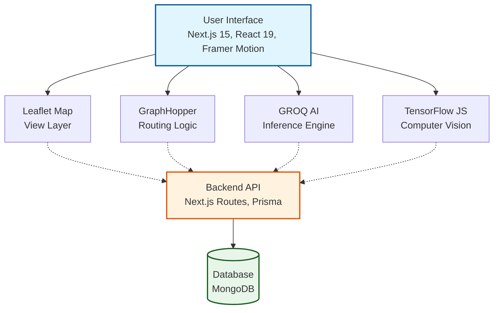

# AgriVision: Intelligent Farming for the Future

AgriVision is a comprehensive precision agriculture platform designed to bridge the gap between advanced technology and practical farming. By integrating computer vision, geospatial analysis, and generative AI, AgriVision empowers farmers to make data-driven decisions that increase yield, reduce waste, and ensure crop health.


---

## The Challenge
Modern farming faces unprecedented challenges: unpredictable climate patterns, complex pest and disease outbreaks, and the rising cost of operations. Farmers often lack immediate access to expert agronomy advice or precise data about their field conditions, leading to reactive rather than proactive management.

## The Solution
AgriVision provides a unified command center for farm management. We combine local device processing with cloud-based intelligence to offer:
- **Instant Disease Diagnosis**: Identify ongoing crop issues before they spread.
- **Precision Mapping**: Monitor field health, moisture, and topography.
- **Actionable Insights**: Get treatment plans and routing optimization instantly.

---

## Detailed Technology Breakdown

We have carefully selected cutting-edge technologies to solve specific agricultural problems. Here is an in-depth look at our stack, how it is implemented, and the tangible value it delivers to the farmer.

### 1. Advanced Logistics & Routing (GraphHopper)
**The Technology**: We utilize the **GraphHopper API**, a powerful open-source routing engine, to handle all navigation and spatial calculations within the app.

**How We Use It**:
- **Isochrone Mapping**: We use the Isochrone API to calculate "reachability polygons." Instead of simple distance circles, these polygons show exactly which areas of the farm can be reached within a specific time limit (e.g., 10, 20, or 30 minutes) considering walking or driving speeds.
- **Route Optimization**: We implement the Route Optimization API to solve the "Traveling Salesman Problem." When a farmer selects multiple fields to inspect, the system automatically reorders the stops to calculate the most efficient path.
- **Geocoding**: We convert GPS coordinates into human-readable addresses and vice-versa to make location tagging intuitive.

**Benefit to the Farmer**:
- **Operational Efficiency**: By optimizing routes between multiple scattered fields, farmers save on fuel costs and significantly reduce travel time.
- **Strategic Planning**: Isochrone maps help farmers understand logistical constraints—for example, knowing exactly which fields are within a 30-minute tractor drive from the storage facility affects harvest planning.
- **Time Management**: Farmers can plan their day with precision, knowing exactly how long it takes to move equipment between active zones.

### 2. Generative AI Agronomist (Groq & Llama 3.1)
**The Technology**: We employ **Meta's Llama 3.1** Large Language Model (LLM), served via **Groq's** specialized Language Processing Units (LPUs) for ultra-low latency inference.

**How We Use It**:
- **Context-Aware Inference**: The system injects real-time farm data (location, soil moisture, elevation, past disease history) into the system prompt. This means the AI doesn't just answer generic questions; it answers questions specifically about *this* farm.
- **High-Speed Chat**: We use Groq chips because they deliver tokens at exceptional speeds, making the conversation feel natural and instantaneous rather than transactional.

**Benefit to the Farmer**:
- **24/7 Expert Access**: Farmers get instant access to an "agronomist" that never sleeps. They can ask complex questions like "Given the recent rain and my soil drainage in Field A, should I apply nitrogen today?" and receive a scientifically grounded answer.
- **Reduced Cognitive Load**: Instead of interpreting raw data charts, the farmer can simply converse with the data in plain language (English or Swahili).

### 3. Edge-Based Computer Vision (TensorFlow.js)
**The Technology**: We use **TensorFlow.js** to run deep learning models (MobileNet architecture) directly in the user's web browser, without needing to send images to a central server for processing.

**How We Use It**:
- **Client-Side Classification**: When a user uploads a leaf image, the neural network analyzes the pixel data locally on the device (smartphone or laptop) to identify plant species and detect disease patterns.

**Benefit to the Farmer**:
- **Offline Capability**: Farming often happens in remote areas with poor internet connectivity. Because the model runs on the device, farmers can diagnose crop diseases even when they are completely offline in the middle of a field.
- **Data Privacy**: Images of proprietary crop strains or field conditions do not leave the farmer's device unless they explicitly choose to save them to the cloud history.
- **Instant Results**: Identification happens in milliseconds, allowing for immediate decision-making.


### 4. Geospatial Visualization (Leaflet & OpenStreetMap)
**The Technology**: The frontend mapping interface is built on **Leaflet.js**, utilizing tile layers from **OpenStreetMap (OSM)** and satellite imagery.

**How We Use It**:
- **Polygon Layering**: Users can draw interactive polygons to define field boundaries. These polygons serve as containers for data—we attach attributes like crop type, planting date, and soil health to these specific geographic shapes.
- **Visual Overlays**: We render data layers (like NDVI health scores or moisture levels) directly on top of the terrain map.

**Benefit to the Farmer**:
- **Visual Management**: Provides a "God's eye view" of the entire operation. A farmer can see at a glance that "The North Field" is healthy (green polygon) while "The River Field" is stressed (yellow polygon).
- **Precision Inputs**: By accurately defining field areas, farmers can calculate exact input needs (fertilizer, seeds) based on acreage, preventing waste and over-purchasing.


### 5. Digital Marketplace (E-Commerce)
**The Technology**: A full-stack marketplace built with Next.js, integrating MongoDB for inventory management and robust search algorithms.

**How We Use It**:
- **Integrated Commerce Hub**: A unified platform where the "Sell" component allows farmers to list produce directly from the field, and the "Buy" component connects them with retailers and consumers.
- **Visual Listings**: Farmers can upload photos of their harvest, set prices, and manage availability in real-time.

**Benefit to the Farmer**:
- **Direct-to-Consumer**: Eliminates middlemen by connecting farmers directly with buyers, ensuring better profit margins.
- **Market Access**: Gives smallholder farmers a digital storefront to reach a wider audience beyond their local community.
- **Reduced Post-Harvest Loss**: Faster connections to buyers mean fresh produce moves quickly, reducing spoilage.


---

## Technical Architecture Overview

AgriVision is built on a modern, scalable stack designed for performance and reliability.




---

## Getting Started

Follow these instructions to set up the development environment on your local machine.

### Prerequisites
- Git
- Node.js 18 or higher
- MongoDB instance (Local or Atlas)
- API Keys for: GraphHopper, Groq

### Installation Steps

1. **Clone the repository**
   Open your terminal and run the following command to download the codebase:
   ```bash
   git clone https://github.com/Khin-96/Agrivision.git
   ```

2. **Navigate into the project directory**
   ```bash
   cd agrivision
   ```

3. **Install dependencies**
   ```bash
   npm install
   ```

4. **Configure Environment Variables**
   Create a `.env` file in the root directory of the project. You can copy the example below:
   ```env
   # Database Connection
   DATABASE_URL="mongodb+srv://..."
   
   # AI Services (Groq for Chatbot)
   GROQ_API_KEY="gsk_..."
   
   # Mapping Services (GraphHopper)
   NEXT_PUBLIC_GRAPHHOPPER_API_KEY="your_key"
   GRAPHHOPPER_API_KEY="your_key"
   
   # Authentication
   NEXTAUTH_SECRET="your_secret_string"
   NEXTAUTH_URL="http://localhost:3000"
   ```

5. **Initialize Database**
   This command enables Prisma to read your schema and prepare the database client:
   ```bash
   npx prisma generate
   ```

6. **Run Development Server**
   Start the local development server:
   ```bash
   npm run dev
   ```

   Visit `http://localhost:3000` in your browser to view the application.

---

## Documentation Library
For specific implementation details, please refer to our internal guides:
- **[Installation Guide](./QUICK_START.md)**
- **[Mapping System Guide](./GRAPHHOPPER_GUIDE.md)**
- **[Technical Architecture](./IMPLEMENTATION_SUMMARY.md)**
- **[Advanced Features](./ADVANCED_FEATURES.md)**

---

**AgriVision** - Empowering farmers with the eyes of AI.